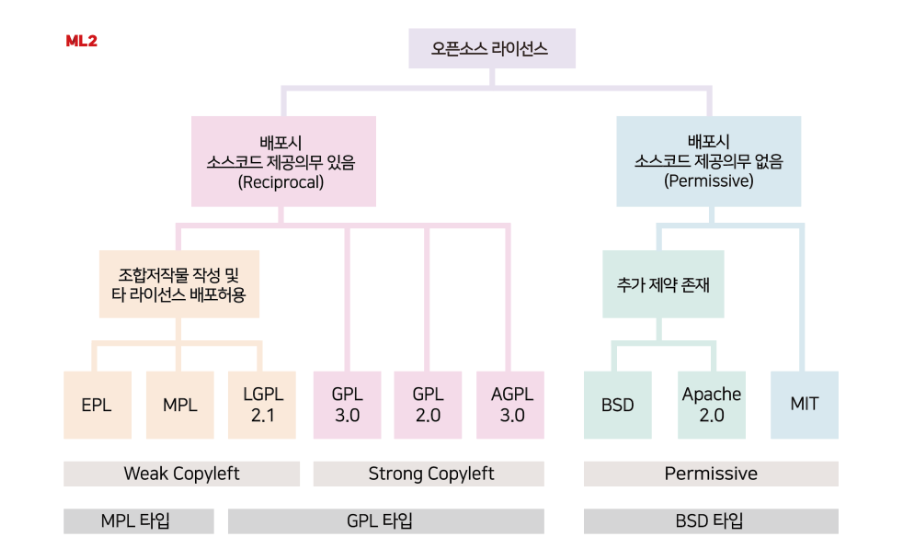

### 1. 다음 중 관련 라이선스가 적용된 소스코드를 수정하여 만든 2차적 젖작물에 대해 소스코드의 비공개가 가능한 라이선스로 틀린것은
1. BSD
2. Apaache
3. MPL
4. MIT


### 2. 다음에 제시된 운영체제 관련 기술 중 하드디스크 공간의 효율성을 높여준 기술로 가장 알맞은 것은?
1. 라이브러리
2. 가상메모리
3. 가상콘솔
4. 파이프

가상메모리 : 물리적 메모리의 한계를 극복하기 위한 기술
가상콘솔 : 가상의 모니터, 사용자마다 별도의 콘솔 제공
파이프 : 명령어 실행결과를 다음 명령어로 전달(표준출력을 다음명령어의 표준입력으로)

### 3. 다음 중 레드햇 계열에 속하는 리눅스 배포판으로 틀린것은?
1. CentOS
2. Scientific Linux
3. Vector Linux
4. Oracle Linux

레드햇 : RHEL, CentOS, Rocky, Fedora, Oracle Linux, Scientific Linux
데비안 : Ubuntu, Raspbian, ChromeOs
슬랙웨어 : Slackware, openSUSE, Vector Linux 등등

### 6. 다음 () 안에 들어갈 내용으로 알맞은 것은?
```
cat example
#!/bin/bash

var=0
cnt=$0

while [ "$var" -le (ㄱ) ]
do
var='expr $var + 1'
done

echo $var

./example
(ㄴ)
```
1. ㄱ : ${#cnt}, s : 8
2. ㄱ : "$cnt" , s : 8
3. ㄱ : ${#cnt}, s : 10
4. ㄱ : "$cnt" , s : 10

var='expr $var + 1' -> var=$(expr $var + 1) 변경 필요
- $# : 스크립트에 전달되는 인자들의 개수
- $0 : 실행스크립트의 전체 경로명. --> 여기선 ./example 임
- $1, $2 : 전달된 인자값을 순서대로 담음
- ${#문자열변수} : 해당 변수의 문자열 길이 반환 --> 여기선 ./example 의 문자열길이 9가 됨

### 7.다음에서 설명하는 데몬 관련 유틸리티로 알맞은 것은?

```
텍스트 환경에서 커서를 이용하여 부팅 중 자동으로 실행되는 서비스를 설정할 수 있는 유틸리티이다.
옵션을 이용하여 특정 실행레벨의 서비스 데몬을 설정할 수 있다.
```
1. systemctl
2. chkconfig
3. ntsysv
4. service

### 10. 다음 중 /etc/rc.d/rc.local 파일에 관한 설명으로 알맞은 것은?
1. 부팅과 관련된 실행 레벨이 정의되어 있다.
2. 시스템 초기화와 관련된 내용이 설정되어 있다.
3. 부팅 시 각 레벨별로 진행되는 내용이 설정된 파일이다.
4. 실행 레벨 2,3,5에서 가장 마지막에 실행되는 파일이다.

rc???
systemd를 사용하는 centos 7 이상에서는 기본적으로 비활성화(기존버전과의 호환성을 위해 기능을 남겨는 둠)
rc.local을 사용하기보다는 systemd의 서비스 등록을 추천.
데몬과 같이 서버 부팅시마다 자동으로 실행되어야 할 명령어가 기록된 파일. 부팅시에 가장 마지막에 실행됨.

실행레벨??
부팅레벨이라고도 불리며 시스템을 실행할 떄 용도별로 구분해서 실행하고자 할 떄사용되는 추상적인 개념
레드햇 계열 7 이상부터는 실행레벨 대신 타켓 유닛을 사용하여 관리(systemd)

### 11. 다음 중 () 안에 들어갈 내용으로 알맞은 것은?
(ㄱ)(은)는 RAID-0의 단점인 결합 허용을 지원하지 않는 점과 RAID-1의 저장 공간의 비효율성을 보완한 레벨로 디스크의 개수를 늘릴수록 저장공간의 효율성이 좋아진다. (ㄴ)(은)는 2개의 패리티를 사용하여 2개의 디스크 오류에도 데이터를 읽을 수 있고 최소 4개의 디 스크로 구성해야한다.

- RAID 0 : 여러디스크에 데이터 저장(스트라이핑)
- RAID 1 : 두개의 디스크에 데이터 복사 저장(미러링)
- RAID 2 : 비트레벨의 스트라이핑, 오류정정부호 ECC 활용, 속도 떨어짐
- RAID 3 : 바이트 수준 스트라이핑, 패리티 제공
- RAID 4 : 블록 수준 스트라이핑, 패리티 제공, 쓰기성능은 안좋음
- RAID 5 : RAID 4와 비슷, 패리티가 모든 디스크에 나눠 저장됨, 현장에서 많이 사용됨
- RAID 6 : RAID 5와 비슷, 추가적으로 2차 패리티 구성, 2개으ㅢ 디스크 오류 대처 가능

### 13. 다음에서 설명하는 내용으로 알맞은 것은?
이것은 X 윈도우를 실행시키는 스크립트로 시스템 환경을 초기화시키고 시작하는데 필요한 여러 프로그램을 호출하고, 최종적으로 xinit을 호출하는 명령어이다.

1. init
2. kde
3. startx
4. gnome

init : 부팅시 최초 실행되는 프로세스
kde : K Desktop Environment의 약자로 기능성에 중심을 둔 그래픽 데스크톱 환경
gnome : 역시 그래픽 데스크톱환경

### 15. 다음 중 시그널에 대한 설명으로 알맞은 것은?

1. SIGKILL은 터미널이 시작될 떄 보내오는 시그널이다.
2. SIGINT는 키보드로부터 오는 인터럽트 시그널로 실행을 중지시킨다.
3. SIGQUIT는 터미널에서 입력된 정지 시그널로 ctrl + c 입력시 보내진다.
4. SIGSTOP은 실행 정지 후 다시 실행하기 위해 대기시키는 시그널이다.

SIGHUP(1) : 로그아웃 또는 접속 끊김
SIGINT(2) : ctrl + c 입력시. 프로세스 종료
SIGQUIT(3) : cirtl + q 입력시. 코어 덤프와 함꼐 프로세스 종료
SIGKILL(9) : 프로세스 즉시 종료(당장 죽어)
SIGTERM(15) : 소프트웨어 종료 시그널. tracking 가능(혹시 미안한데 지금 죽어주시겠어요?)
SITSTOP(19) : 프로세스 정지
SITGSTP(20) : ctrl + z 프로세스 일시정지(대기상태), 트래킹 가능

### 18. 다음 설명과 같을 때 설정하는 서브넷 마스크 값으로 가장 알맞은 것은?
C 클래스에 속한 1개의 네트워크를 할당받은 상태이다. 이 네트워크 대역을 사용하는 부서가 4곳이라 4개의 서브넷을 구성하려고 한다.

128 + 64 = 192
255.255.255.192

### 21.다음 () 안에 들어갈 내용으로 알맞은 것은?
```
$ umask ()
$ touch a.txt
$ mkdir aaa
$ ls -l
----w--w-. ihduser ihduser 0 09:11 a.txt
d----w--w-. ihduser ihduser 4096 09:11 aaa
```

umask : ???
파일 : 666 - ??? = 022
-> 기본 권한 : rw-rw-rw-
-> umask : 
-> 뺀 결과값 : ----w--w-

디렉토리 : 777 - ??? = 022
-> 기본 권한 : rwxrwxrwx
-> umask : 
-> 뺀 결과값 : ----w--w-

이럴러면 umask : rwxr-xr-x 이어야함 -> 755

### 22. 다음과 같이 /etc/passwd 파일만으로 사용자 계정을 관리하였으나 보안상으ㅢ 문제로 인해 다시 /etc/shadow 파일에 사용자 패스워드를 관리하려고 할 떄 사용하는 명령으로 알맞은 것은?

```
grep root /etc/passwd
operator:x:11:0:operator:/root:/sbin/nologin
```

1. pwck
2. pwconv
3. pwunconv
4. vipw

pwck : pwck 명령어는 /etc/passwd와 /etc/shadow 파일을 검사하여, 사용자 계정 정보가 올바르게 구성되어 있는지 확인합니다.

```
[root@adGuard ~]# pwck
사용자 'cockpit-ws': '/nonexisting' 디렉터리가 없습니다
사용자 'cockpit-wsinstance': '/nonexisting' 디렉터리가 없습니다
pwck: 바뀐 점이 없음
```

pwconv : pwconv 명령어는 /etc/passwd 파일에서 암호 정보를 추출하여 /etc/shadow 파일로 옮깁니다.
pwunconv : pwunconv 명령어는 /etc/shadow 파일에 있는 암호 정보를 다시 /etc/passwd 파일로 병합합니다.
vipw : vipw 명령어는 텍스트 편집기(기본적으로 vi 또는 시스템에 설정된 편집기)를 사용하여 /etc/passwd 파일을 안전하게 편집할 수 있도록 합니다.

### 23. 다음 () 안에 들어갈 내용으로 알맞은 것은?
```
# tar (ㄱ)xvf httpd-2.2.34.tar.bz2
# tar (ㄴ)xvf httpd-2.2.34.tar.xz
# tar (ㄷ)xvf httpd-2.2.34.tar.gz
```

파일을 압축하거나 압축된 파일을 해제할 떄 쓰는 명령어
기본옵션
A : 기존 압축파일에 tar 파일 추가
c : 새로운 파일 만들기
d : 기존 파일과의 차이
r : 기존 파일에 마지막 파일 추가
t : 압축된 파일 목록 출력
u : 압축된 파일과 비교하여 최신날짜일 경우 업데이트
x : 압축해제

부가옵션
v : 진행중인 파일 표시
f : 파일명 지정
z : gzip
j : bzip2
J : xz

### 25.다음 중 프로세스의 우선순위를 변경할 떄 사용하는 명령으로 틀린 것은?
1. top
2. jobs
3. nice
4. renice

jobs: 백그라운드로 실행중인 프로세스나 현재 중지된 프로세스의 목록을 출력하는 명령어
top로도 우선순위 변경가능
1. top 명령어 실행
2. 우선순위 변경
  - top화면에서 r키를 눌러 우선순위 변경가능

### 27. 다음 중 사용자 추가할 때 할당되는 UID의 값을 1000번부터 부여되도록 지정할 때 설정하는 파일은?
1. /etc/skel
2. /etc/shadow
3. /etc/login.defs
4. /etc/default/useradd

/etc/skel : 계정생성시 해당 디렉토리 밑의 내용들이 사용자의 홈디렉터리로 복사됨. bashrc등
/etc/default/useradd : useradd 명령어를 사용하여 새로운 사용자를 추가할 떄 기본값.(홈디렉터리 위치등)

### 31. 다음 중 시스템 전체에서 Set-UID가 설정된 파일을 전부 찾는 명령으로 알맞은 것은?
1. find / -type f -perm 4000
2. find / -type f -perm -4000
3. find / -type -f -perm 4000
4. find / -type -f -perm -4000


-perm 4000 : 권한이 4000인 파일
-perm -4000: 지정한 비트가 정확히 설정한 값으로 켜져있는 파일(4) -> 즉 Set-UID 비트가 설정된 모든 파일
-perm /4000 : 지정된 비트가 켜져있기만 하면 되는 파일 -> Set-UID가 아니어도 찾을 수 있음